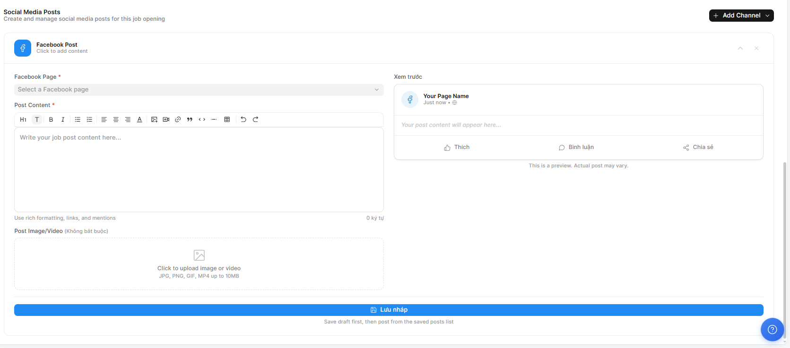

# Kết nối và đăng tin lên Facebook

## 1. Mục tiêu

* Mở rộng phạm vi tiếp cận: Đưa tin tuyển dụng tiếp cận cộng đồng ứng viên khổng lồ trên Facebook chỉ với vài thao tác.
* Quản lý tập trung: Đăng bài và theo dõi nội dung quảng bá tuyển dụng ngay trên một hệ thống duy nhất, không cần chuyển đổi nhiều tab.
* Tối ưu hình ảnh thương hiệu: Đảm bảo bài đăng có định dạng chuẩn, chuyên nghiệp thông qua tính năng xem trước (Preview).

## 2. Khi nào dùng?

* Ngay sau khi bạn vừa tạo xong một tin tuyển dụng mới và muốn bắt đầu chiến dịch truyền thông.
* Khi bạn muốn tận dụng các Fanpage của công ty để thu hút ứng viên thụ động.
* Khi cần đăng tin nhanh vào các hội nhóm hoặc trang cá nhân phụ trách tuyển dụng.

## 3. Các bước thực hiện

### Bước 1 - Chọn kênh đăng tin:&#x20;

* Tại khu vực Social Media Posts của tin tuyển dụng, nhấn nút + Add Channel ở góc phải và chọn biểu tượng Facebook.

<figure><figcaption></figcaption></figure>

### Bước 2 - Kết nối Fanpage:&#x20;

* Trong mục Facebook Page, chọn trang Fanpage mà bạn muốn đăng tin (Hệ thống sẽ hiển thị danh sách các trang bạn có quyền quản trị).

### Bước 3 - Biên tập nội dung (Post Content):

<figure><figcaption></figcaption></figure>

* Nhập nội dung bài đăng vào khung soạn thảo. Bạn có thể sử dụng các công cụ định dạng (in đậm, danh sách gạch đầu dòng) để làm nổi bật quyền lợi và yêu cầu.
* Tải ảnh/Video: Nhấp vào vùng Post Image/Video để tải lên hình ảnh thiết kế hoặc video giới thiệu công việc (Hỗ trợ JPG, PNG, GIF, MP4 lên đến 10MB).

### Bước 4 - Xem trước (Preview):&#x20;

* Quan sát khung Xem trước ở bên phải để kiểm tra hiển thị bài đăng trên thiết bị di động/máy tính. Điều chỉnh lại nội dung nếu văn bản bị cắt hoặc hình ảnh chưa cân đối.

### Bước 5 - Lưu và Đăng:&#x20;

* Nhấn Lưu nháp để kiểm tra lại lần cuối hoặc xác nhận đăng để bài viết xuất hiện trên Fanpage đã chọn.

## 4. Kết quả

* Một bài đăng tuyển dụng chuyên nghiệp xuất hiện trên Facebook với đầy đủ hình ảnh và nội dung thu hút.
* Hệ thống ghi nhận trạng thái đã đăng, giúp bạn quản lý được tin nào đã được quảng bá trên mạng xã hội, tin nào chưa.
* Ứng viên có thể tương tác trực tiếp qua bài đăng trên Facebook để tìm hiểu thêm về công việc.

## 5. Lưu ý quan trọng

* Quyền quản trị: Bạn cần đảm bảo tài khoản Facebook của mình đã được cấp quyền biên tập viên hoặc quản trị viên của Fanpage đó để có thể kết nối thành công.
* Tương tác hình ảnh: Bài đăng có kèm theo hình ảnh (văn phòng, đội ngũ) hoặc video ngắn thường có tỉ lệ ứng viên click vào cao hơn gấp 3 lần so với chỉ có văn bản.
* Lưu nháp trước khi đăng: Nên sử dụng tính năng Lưu nháp để bộ phận quản lý hoặc marketing duyệt lại nội dung/hình ảnh trước khi chính thức công khai.
* Định dạng file: Nếu tải video, hãy đảm bảo dung lượng dưới 10MB để quá trình tải và hiển thị trên Facebook mượt mà nhất.
